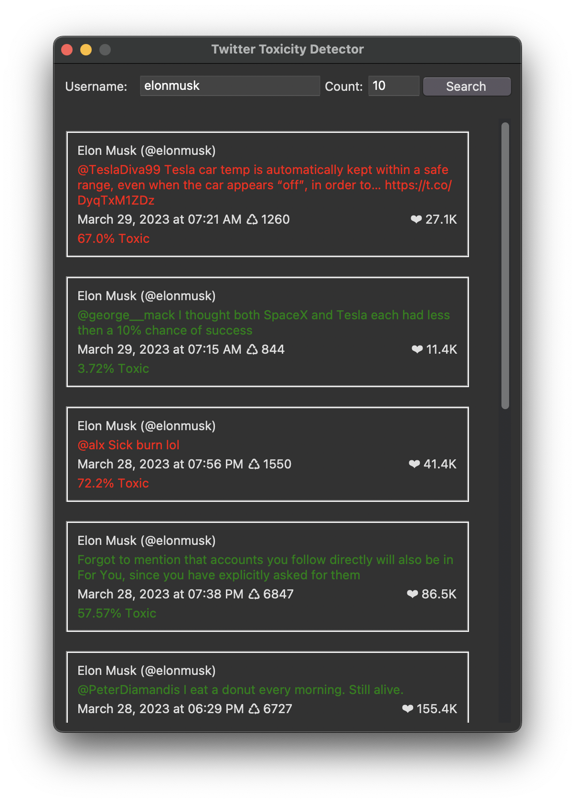

# Twitter Toxicity Detection Python

This is a simple python program which uses a machine learning model to detect toxicity in tweets. It implements a simple GUI using tkinter and uses sklearn to train the model and predict the toxicity of the tweet. This is a very basic project you can learn from it and create a better model, to check more about my AI/ML projects you can visit my company's [website.](https://www.spyxpo.com/)

## Screenshot



## Installation

You may need to install some dependencies before running the program(some of the modules cannot be installed directly by using `requirements.txt`).

```bash
git clone https://github.com/mantreshkhurana/twitter-toxicity-detection-python.git
cd twitter-toxicity-detection-python
pip3 install -r requirements.txt
python3 detector.py
```

or

```bash
git clone https://github.com/mantreshkhurana/twitter-toxicity-detection-python.git
cd twitter-toxicity-detection-python
pip install -r requirements.txt
python detector.py
```

## Author

- [Mantresh Khurana](https://github.com/mantreshkhurana)
