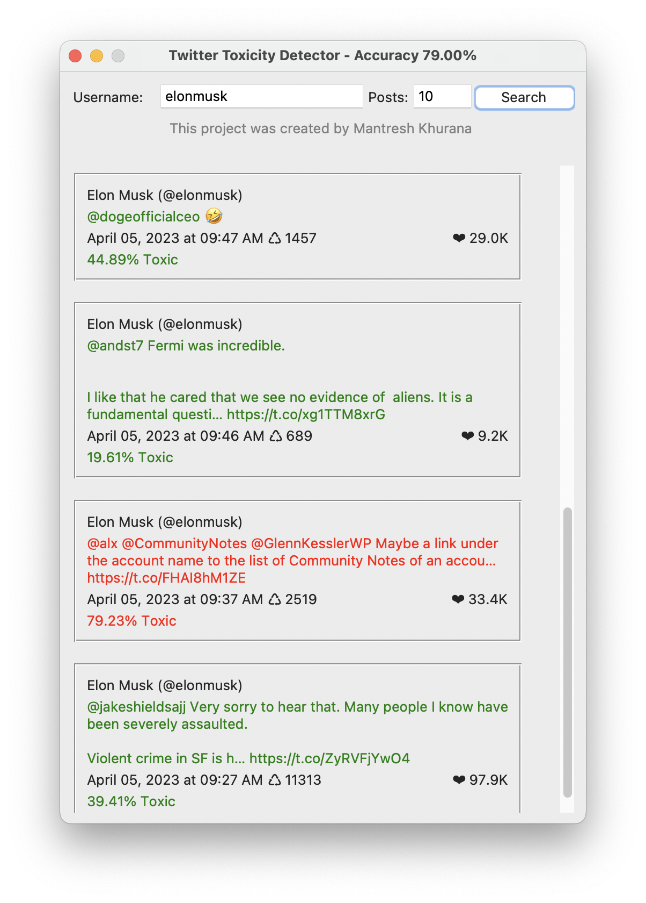
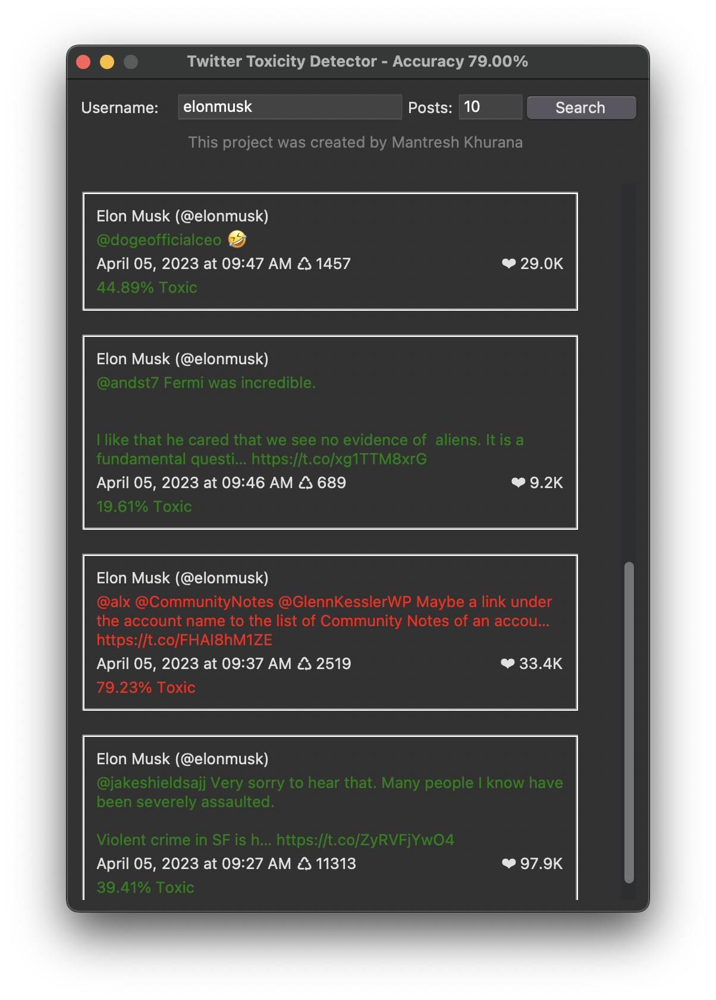

# Twitter Toxicity Detection Python

This is a simple python program which uses a machine learning model to detect toxicity in tweets. It implements a simple GUI using tkinter and uses sklearn to train the model and predict the toxicity of the tweet. This is a very basic project you can learn from it and create a better model, to check more about my AI/ML projects you can visit my company's [website.](https://www.spyxpo.com/)

## Tabel of Contents

- [Twitter Toxicity Detection Python](#twitter-toxicity-detection-python)
  - [Screenshots](#screenshots)
  - [Installation](#installation)
  - [Contributing](#contributing)
  - [Author](#author)

## Screenshots

It supports both light and dark mode.

| Light | Dark |
| ----- | ---- |
|  | |

## Installation

You may need to install some dependencies before running the program(some of the modules cannot be installed directly by using `requirements.txt`).

```bash
git clone https://github.com/mantreshkhurana/twitter-toxicity-detection-python.git
cd twitter-toxicity-detection-python
pip install -r requirements.txt
touch .env
echo "CONSUMER_KEY=<your_twitter_api_consumer_key>" >> .env # replace <your_twitter_api_consumer_key> with your Twitter API consumer key
echo "CONSUMER_SECRET=<your_twitter_api_consumer_secret>" >> .env # replace <your_twitter_api_consumer_secret> with your Twitter API consumer secret
echo "ACCESS_TOKEN=<your_twitter_api_access_token>" >> .env # replace <your_twitter_api_access_token> with your Twitter API access token
echo "ACCESS_TOKEN_SECRET=<your_twitter_api_access_token_secret>" >> .env # replace <your_twitter_api_access_token_secret> with your Twitter API access token secret
python detector.py
```

or

```bash
git clone https://github.com/mantreshkhurana/twitter-toxicity-detection-python.git
cd twitter-toxicity-detection-python
pip3 install -r requirements.txt
touch .env
echo "CONSUMER_KEY=<your_twitter_api_consumer_key>" >> .env # replace <your_twitter_api_consumer_key> with your Twitter API consumer key
echo "CONSUMER_SECRET=<your_twitter_api_consumer_secret>" >> .env # replace <your_twitter_api_consumer_secret> with your Twitter API consumer secret
echo "ACCESS_TOKEN=<your_twitter_api_access_token>" >> .env # replace <your_twitter_api_access_token> with your Twitter API access token
echo "ACCESS_TOKEN_SECRET=<your_twitter_api_access_token_secret>" >> .env # replace <your_twitter_api_access_token_secret> with your Twitter API access token secret
python3 detector.py
```

## Contributing

Since this project took <1 hour to make you may find some bugs or you may want to add some features to it. You can contribute to this project by forking it and making a pull request(I am quite active on Github so if any issue arises I will try to fix it as soon as possible).

After forking:

```bash
git clone https://github.com/mantreshkhurana/twitter-toxicity-detection-python.git
cd twitter-toxicity-detection-python
git checkout -b <your-branch-name>
# After adding your changes
git add .
git commit -m "your commit message"
git push origin <your-branch-name>
```

## Author

- [Mantresh Khurana](https://github.com/mantreshkhurana)

## Credits

- [Twitter](https://twitter.com/)
- [Sklearn](https://scikit-learn.org/stable/)
- [Python](https://www.python.org/)
- [Tweepy](https://www.tweepy.org/)
